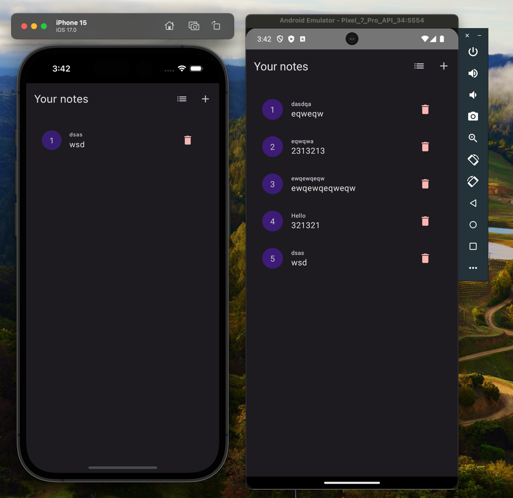
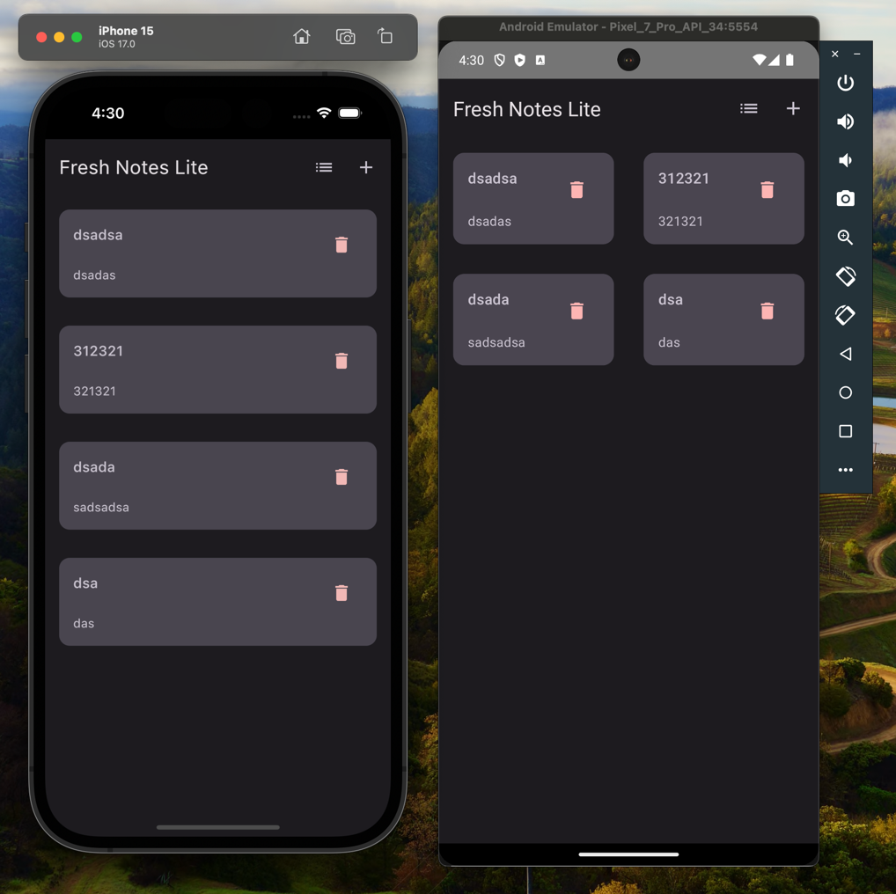
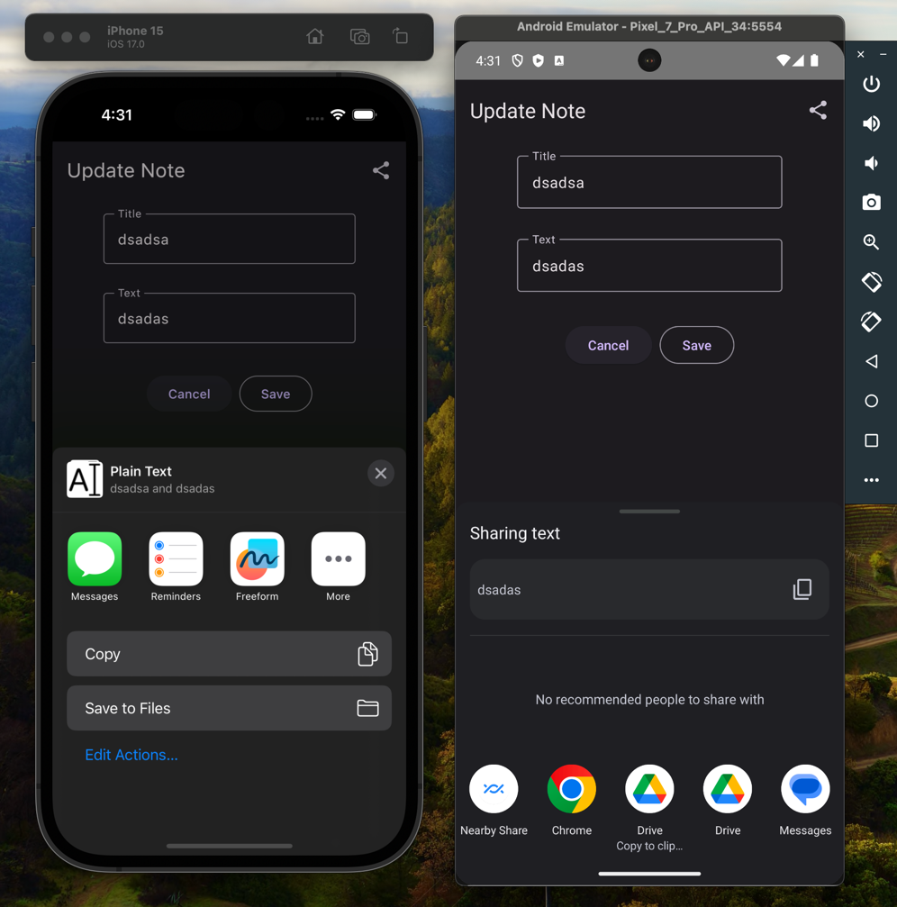
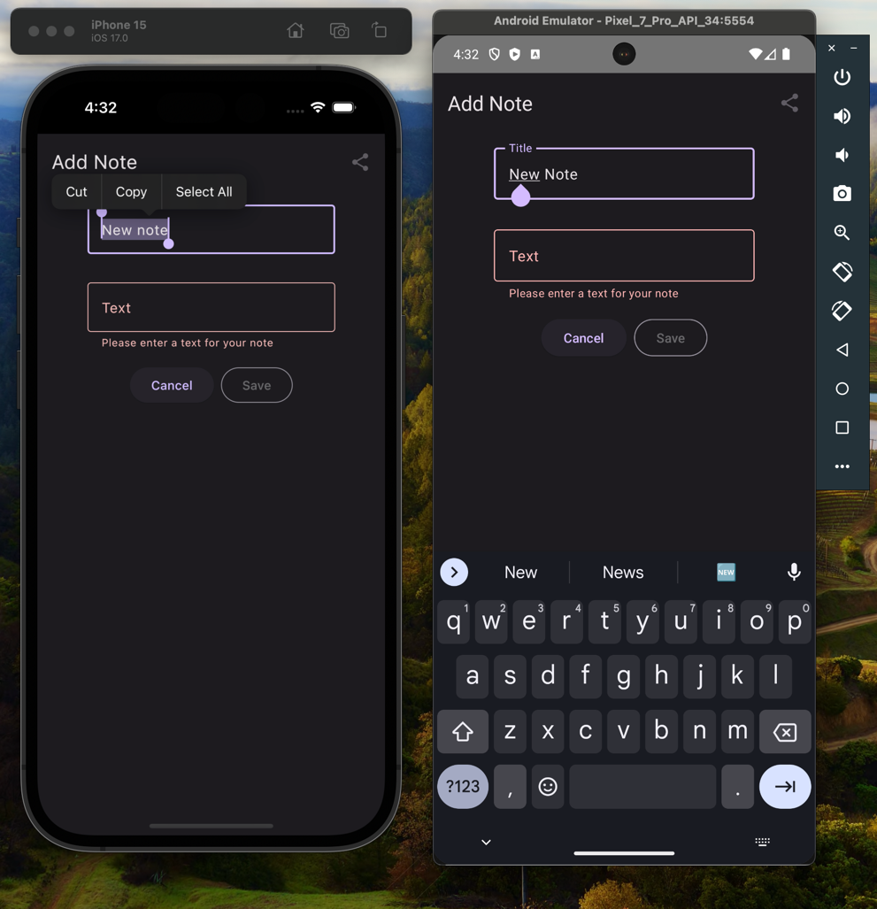
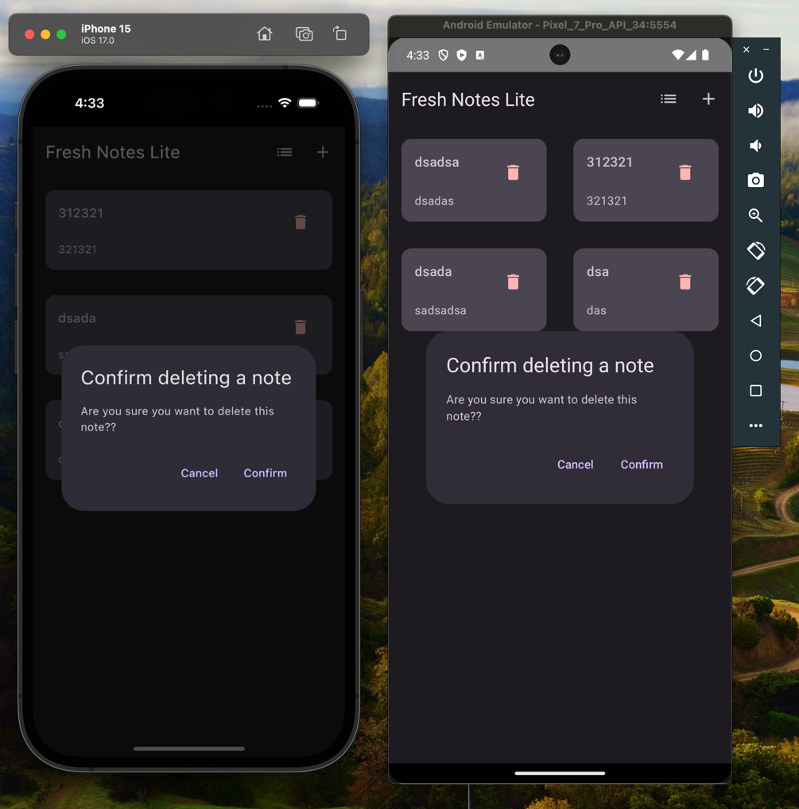
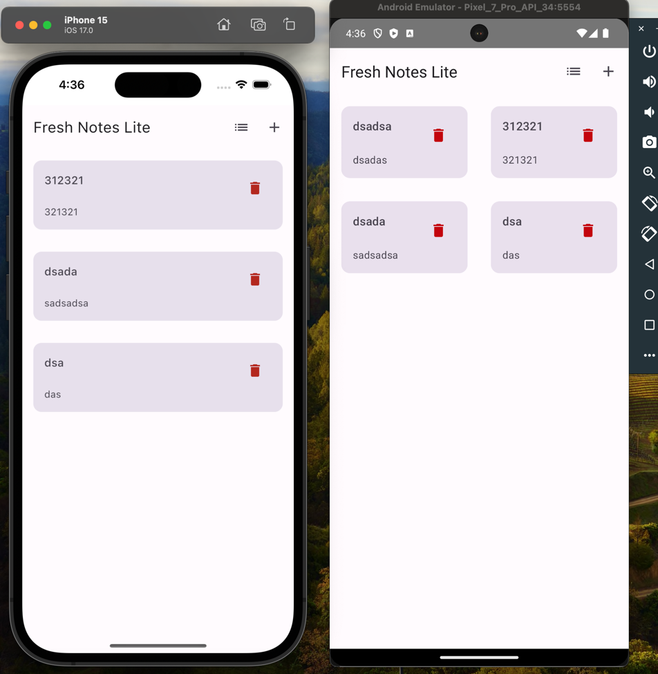

# KMP Notes App
A simple toy app written in Kotlin, Swift and it have shared ui using Compose multiplatform
I created this app for fun and explore KMP since now it has it first stable release, but most importantly
I want to create a different simplified version of [Fresh Notes App](https://github.com/freshtechtips/fresh-notes-app)
which is written in Flutter, I used Java first then moved to Kotlin and I have using it for many years and I really like it
Of course I prefer to use Kotlin for the cross platform apps that have shared Ui and Logic and I wanted to give it a try and it
was amazing and more than I expected, the only things that is missing in my opinion are hot-reload and hot-restart which will
I'm used to it in `Flutter`, `NodeJs`, `Ktor server` and some other frameworks like `React` and `NextJs` etc...

By the time of creating this simple app the Fresh notes app haven't finished yet since there are other tasks but it will be soon.

## Images

## Known issues
1. When you run the app on iOS and get back to the home screen of the system while the app is still not closed, you will get crash, for more [info](https://github.com/Tlaster/PreCompose/issues/173)